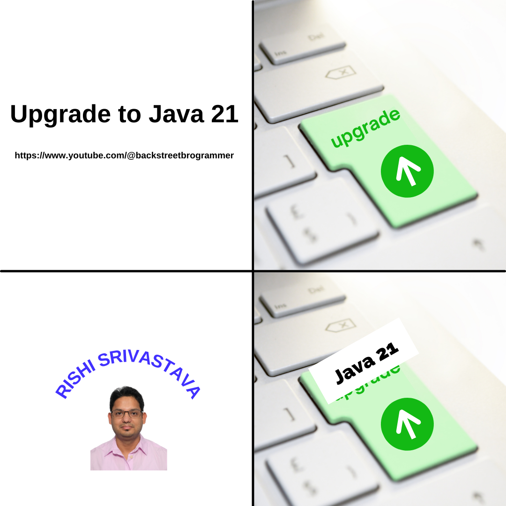

# Upgrade To Java 21

> This is a tutorial course covering new features and upgrade to Java 21 LTS version.

Tools used:

- JDK 21
- Maven
- JUnit 5, Mockito
- IntelliJ IDE

Java 21 is released on **19-Sep-2023** as the next long-term support (**LTS**) release of Oracle's standard Java
implementation.

Java 21 has the following **15** features:

- String Templates (Preview) [JEP-430](https://openjdk.org/jeps/430)
- Sequenced Collections [JEP-431](https://openjdk.org/jeps/431)
- Generational ZGC [JEP-439](https://openjdk.org/jeps/439)
- Record Patterns [JEP-440](https://openjdk.org/jeps/440)
- Pattern Matching for switch [JEP-441](https://openjdk.org/jeps/441)
- Foreign Function & Memory API (Third Preview) [JEP-442](https://openjdk.org/jeps/442)
- Unnamed Patterns and Variables (Preview) [JEP-443](https://openjdk.org/jeps/443)
- Virtual Threads [JEP-444](https://openjdk.org/jeps/444)
- Unnamed Classes and Instance Main Methods (Preview) [JEP-445](https://openjdk.org/jeps/445)
- Scoped Values (Preview) [JEP-446](https://openjdk.org/jeps/446)
- Vector API (Sixth Incubator) [JEP-448](https://openjdk.org/jeps/448)
- Deprecate the Windows 32-bit x86 Port for Removal [JEP-449](https://openjdk.org/jeps/449)
- Prepare to Disallow the Dynamic Loading of Agents [JEP-451](https://openjdk.org/jeps/451)
- Key Encapsulation Mechanism API [JEP-452](https://openjdk.org/jeps/452)
- Structured Concurrency (Preview) [JEP-453](https://openjdk.org/jeps/453)

## Table of contents

1. Java Installation and Project Setup
    - Java 21 installation
    - Maven installation
    - IntelliJ installation
    - Project Setup
2. Project Loom
    - Virtual Threads
    - Scoped Values
    - Structured Concurrency
3. Project Amber
    - String Templates
    - Record Patterns
    - Pattern matching for switch
    - Unnamed Patterns and Variables
    - Unnamed Classes and Instance Main Methods
4. Project Panama
    - Foreign Function & Memory API
    - Vector API
5. Core Libraries
    - Sequenced Collections
6. Performance Updates
    - Generational ZGC
    - Key Encapsulation Mechanism API
7. Maintenance and Deprecation
    - Deprecate the Windows 32-bit x86 Port for Removal
    - Prepare to Disallow the Dynamic Loading of Agents

## Youtube

[Upgrade To Java 21 playlist](https://www.youtube.com/playlist?list=PLQDzPczdXrTjGmXvnHtnQ6S1i5pO0-NvK)

- [01 - Upgrade to Java 21 - Tutorial Series](https://youtu.be/5IPiXr95nrA)
- [02 - Upgrade to Java 21 - Table Of Contents](https://youtu.be/QmZ8Uy0uy7w)

---

