# Upgrade To Java 21

> This is a tutorial course covering new features and upgrade to Java 21 LTS version.


Tools used:

- JDK 21
- Maven
- JUnit 5, Mockito
- IntelliJ IDE

Java 21 is released on **19-Sep-2023** as the next long-term support (**LTS**) release of Oracle's standard Java
implementation.

Java 21 has the following **15** features:

- String Templates (Preview) [JEP-430](https://openjdk.org/jeps/430)
- Sequenced Collections [JEP-431](https://openjdk.org/jeps/431)
- Generational ZGC [JEP-439](https://openjdk.org/jeps/439)
- Record Patterns [JEP-440](https://openjdk.org/jeps/440)
- Pattern Matching for switch [JEP-441](https://openjdk.org/jeps/441)
- Foreign Function & Memory API (Third Preview) [JEP-442](https://openjdk.org/jeps/442)
- Unnamed Patterns and Variables (Preview) [JEP-443](https://openjdk.org/jeps/443)
- Virtual Threads [JEP-444](https://openjdk.org/jeps/444)
- Unnamed Classes and Instance Main Methods (Preview) [JEP-445](https://openjdk.org/jeps/445)
- Scoped Values (Preview) [JEP-446](https://openjdk.org/jeps/446)
- Vector API (Sixth Incubator) [JEP-448](https://openjdk.org/jeps/448)
- Deprecate the Windows 32-bit x86 Port for Removal [JEP-449](https://openjdk.org/jeps/449)
- Prepare to Disallow the Dynamic Loading of Agents [JEP-451](https://openjdk.org/jeps/451)
- Key Encapsulation Mechanism API [JEP-452](https://openjdk.org/jeps/452)
- Structured Concurrency (Preview) [JEP-453](https://openjdk.org/jeps/453)

## Table of contents

1. [Java Installation and Project Setup](https://github.com/backstreetbrogrammer/38_UpgradeToJava21?tab=readme-ov-file#chapter-01-java-installation-and-project-setup)
    - [Java 21 installation](https://github.com/backstreetbrogrammer/38_UpgradeToJava21?tab=readme-ov-file#java-21-installation)
    - [Maven installation](https://github.com/backstreetbrogrammer/38_UpgradeToJava21?tab=readme-ov-file#maven-installation)
    - [IntelliJ installation](https://github.com/backstreetbrogrammer/38_UpgradeToJava21?tab=readme-ov-file#intellij-installation)
    - [Project Setup](https://github.com/backstreetbrogrammer/38_UpgradeToJava21?tab=readme-ov-file#project-setup)
2. [Project Loom](https://github.com/backstreetbrogrammer/38_UpgradeToJava21?tab=readme-ov-file#chapter-02-project-loom)
    - [Virtual Threads](https://github.com/backstreetbrogrammer/38_UpgradeToJava21?tab=readme-ov-file#virtual-threads)
        - [Limitation of current server applications](https://github.com/backstreetbrogrammer/38_UpgradeToJava21?tab=readme-ov-file#limitation-of-current-server-applications)
        - [Blocking, Non-Blocking, Asynchronous Server](https://github.com/backstreetbrogrammer/38_UpgradeToJava21?tab=readme-ov-file#blocking-non-blocking-asynchronous-server)
        - [Virtual Threads - Deep Dive](https://github.com/backstreetbrogrammer/38_UpgradeToJava21?tab=readme-ov-file#virtual-threads---deep-dive)
    - Scoped Values
    - Structured Concurrency
3. Project Amber
    - String Templates
    - Record Patterns
    - Pattern matching for switch
    - Unnamed Patterns and Variables
    - Unnamed Classes and Instance Main Methods
4. Project Panama
    - Foreign Function & Memory API
    - Vector API
5. Core Libraries
    - Sequenced Collections
6. Performance Updates
    - Generational ZGC
    - Key Encapsulation Mechanism API
7. Maintenance and Deprecation
    - Deprecate the Windows 32-bit x86 Port for Removal
    - Prepare to Disallow the Dynamic Loading of Agents

## Youtube

[Upgrade To Java 21 playlist](https://www.youtube.com/playlist?list=PLQDzPczdXrTjGmXvnHtnQ6S1i5pO0-NvK)

- [01 - Upgrade to Java 21 - Tutorial Series](https://youtu.be/5IPiXr95nrA)
- [02 - Upgrade to Java 21 - Table Of Contents](https://youtu.be/QmZ8Uy0uy7w)

---

## Chapter 01. Java Installation and Project Setup

### Java 21 installation

Search **Java 21 download** in [Google](https://www.google.com/) and navigate to Oracle
[Java Downloads](https://www.oracle.com/hk/java/technologies/downloads/) page.

Based on the OS, we can download installation file.

For **Windows**, download exe file:
[x64 Installer](https://download.oracle.com/java/21/latest/jdk-21_windows-x64_bin.exe)

Double-click the installer exe file and follow the default instructions to install JDK 21.

Once complete, JDK 21 will be installed in `C:\Program Files\Java\jdk-21`.

Set `JAVA_HOME` system variable and also set it in `Path`.

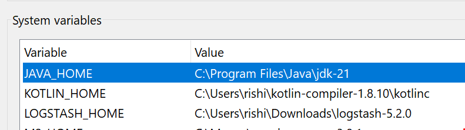

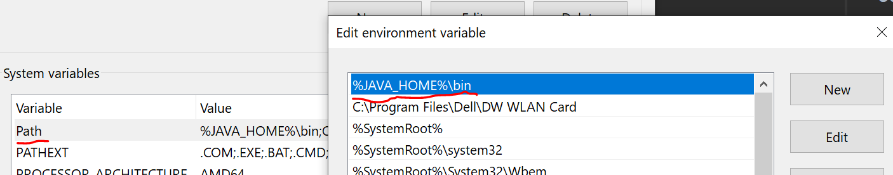

Open `cmd` and verify Java version:

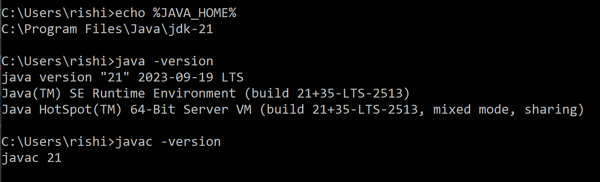

### Maven installation

Search **maven download** in [Google](https://www.google.com/) and navigate to
[Download Apache Maven](https://maven.apache.org/download.cgi) page.

Based on the OS, we can download installation file.

For **Windows**, download zip file:
[Binary zip archive](https://dlcdn.apache.org/maven/maven-3/3.9.4/binaries/apache-maven-3.9.4-bin.zip)

Extract the folder in any local directory: `C:\Maven\apache-maven-3.9.4`.

Set `M2_HOME` and `MAVEN_HOME` system variables and also set it in `Path`.

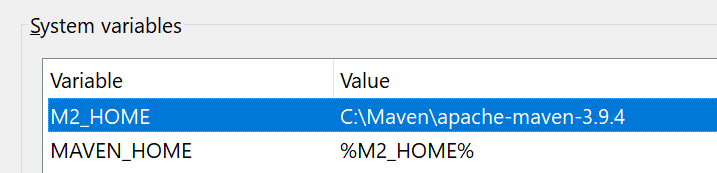

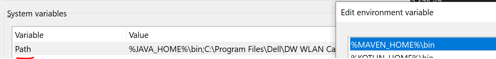

Open `cmd` and verify Maven version:

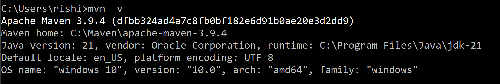

### IntelliJ installation

Search **intellij download** in [Google](https://www.google.com/) and navigate to
[IntelliJ IDEA Download](https://www.jetbrains.com/idea/download/#section=windows) page.

Based on the OS, we can download IntelliJ **Community** Edition:

[Windows IntelliJ](https://www.jetbrains.com/idea/download/download-thanks.html?platform=windows&code=IIC)

Please note that the latest IntelliJ IDEA **2023.2.2** version already supports JDK 21.

If IntelliJ was already installed before, we can just Update it to the latest version from:

```
Help -> Check for Updates...
```

### Project Setup

Once the new project is created in IntelliJ using Java 21, **Open Module Settings** of the project and set as following:

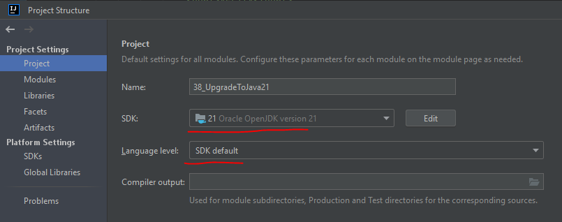

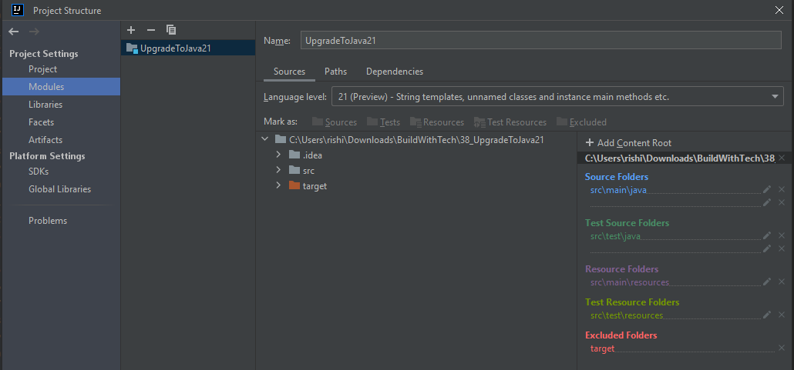

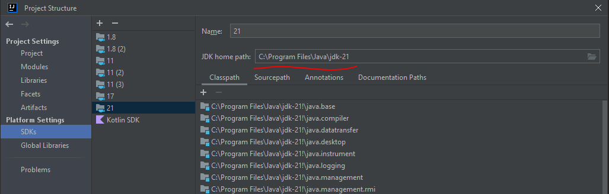

We need to configure the **latest** versions of each maven [dependency](https://mvnrepository.com/) and maven
[plugins](https://maven.apache.org/plugins/) to ensure that its compatible with Java 21.

[JEP 11: Incubator Modules](https://openjdk.org/jeps/11)

**Summary**

Incubator modules are a means of putting **non-final** APIs and non-final tools in the hands of developers, while the
APIs/tools progress towards either finalization or removal in a future release.

**Goals**

Enable JDK Release Projects to distribute a limited set of APIs and tools that not final and complete, and which would
benefit from developer or user feedback. This will reduce the chance of costly mistakes in the Java SE Platform and the
JDK.

[JEP 12: Preview Features](https://openjdk.org/jeps/12)

**Summary**

A preview feature is a new feature of the Java language, Java Virtual Machine, or Java SE API that is fully specified,
fully implemented, and yet impermanent. It is available in a JDK feature release to provoke developer feedback based on
real world use; this may lead to it becoming permanent in a future Java SE Platform.

**Goals**

- Allow Java platform developers to communicate whether a new feature is "coming to Java" in approximately its current
  form within the next 12 months.
- Define a model for partitioning new language, VM, and API features based on whether they are permanent or
  impermanent in
  the Java SE Platform (that is, whether they will exist in the same form for all future releases, or will exist in a
  different form or not at all).
- Communicate the intent that code which uses preview features from an older release of the Java SE Platform will not
  necessarily compile or run on a newer release.
- Outline the relationship between preview features on the one hand, and "experimental" (HotSpot) / "incubating" (API)
  features on the other hand.

**Difference between Incubator Module and Preview Feature**

- Incubation applies to modules, and a preview feature is something that is more closely tight in with the language and
  the libraries. ~ **_Stuart Marks_**
- Preview features are really finished but are waiting for a round of feedback whereas the incubator mechanism has more
  room to iterate over the api several times to get feedback. ~ **_Brian Goetz_**

[JEP-451: Prepare to Disallow the Dynamic Loading of Agents](https://openjdk.org/jeps/451)

The procedure of loading a Java agent into an already running JVM is called **dynamic load**. The agent is attached
using the `Java Attach API`.

**Summary**

Issue warnings when agents are loaded dynamically into a running JVM. These warnings aim to prepare users for a future
release which **disallows** the **dynamic loading of agents** by default in order to improve integrity by default.
Serviceability tools that load agents at startup will not cause warnings to be issued in any release.

**Goals**

- Prepare for a future release of the JDK that will, by default, disallow the loading of agents into a running JVM.
- Reassess the balance between serviceability, which involves ad-hoc changes to running code, and integrity, which
  assumes that running code is not arbitrarily changed.
- Ensure that the majority of tools — which do not need to load agents dynamically — are unaffected.
- Align the ability to load agents dynamically with other so-called "superpower" capabilities, such as deep reflection.

Use the given [pom.xml](https://github.com/backstreetbrogrammer/38_UpgradeToJava21/blob/main/pom.xml) file as a template
for creating and building Java Maven project in IntelliJ.

From Maven gutter in the right pane of IntelliJ IDE -> click on `Lifecycle -> verify`

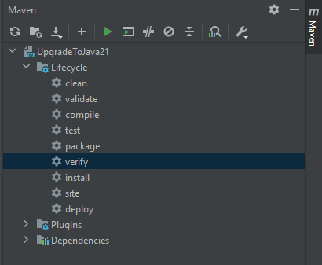

**Smoke Test to verify all the project setup is good**

```java
import org.junit.jupiter.api.DisplayName;
import org.junit.jupiter.api.Test;

import static java.lang.StringTemplate.STR;
import static org.junit.jupiter.api.Assertions.assertEquals;

public class StringTemplateTest {

    @Test
    @DisplayName("Test String Templates (Preview) [JEP-430]")
    void testStringTemplates() {
        final var java = "Java 21";
        final var comment = STR."\{java} is awesome";
        assertEquals("Java 21 is awesome", comment);
    }
}
```

Run the above unit test case from IntelliJ or alternatively from **Terminal**: `mvn clean test`

Successful run of the above unit test case will confirm the whole project setup is good.

### Youtube

- [03 - JDK 21, Maven, IntelliJ installation and project setup](https://youtu.be/nJ2mEUrYiS4)
- [04 - Java 21 Maven project setup in IntelliJ](https://youtu.be/QYfRkyZ3Ql0)

---

## Chapter 02. Project Loom

### Virtual Threads

Virtual threads are **lightweight** threads that dramatically reduce the effort of writing, maintaining, and observing
**high-throughput concurrent** applications.

**Goals**

- Enable server applications written in the simple **thread-per-request** style to scale with near-optimal hardware
  utilization
- Enable existing code that uses the `java.lang.Thread` API to adopt virtual threads with minimal change
- Enable easy **troubleshooting**, **debugging**, and **profiling** of virtual threads with existing JDK tools

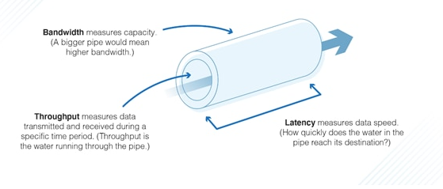

#### Limitation of current server applications

Server applications generally handle concurrent user requests that are independent of each other, so it makes sense for
an application to handle a request by dedicating a thread to that request for its entire duration.

This **thread-per-request** style is easy to understand, easy to program, and easy to debug and profile because it uses
the platform's unit of concurrency to represent the application's unit of concurrency.

**Little's Law**
> In mathematical queueing theory, Little's law is a theorem by John Little which states that the long-term average
> number L of customers in a stationary system is equal to the long-term average effective arrival rate λ multiplied by
> the average time W that a customer spends in the system.

```
L = λ * W
```

For example,

Little's Law tells us that the average number of customers in the store `L`, is the effective arrival rate `λ`, times
the average time that a customer spends in the store `W`.

Assume customers arrive at the rate of `10 per hour` and stay an average of `0.5 hour`. This means we should find the
average number of customers in the store at any time to be 5.

```
L = 10 * 0.5 = 5
```

The scalability of server applications is governed by **_Little's Law_**, which relates **latency**, **concurrency**,
and **throughput**:

For a given request-processing duration (i.e., **latency**), the number of requests an application handles at the same
time (i.e., **concurrency**) must grow in proportion to the rate of arrival (i.e., **throughput**).

For example, suppose an application with an average **latency** of `50ms` achieves a **throughput** of
`200 requests per second` by processing `10 requests` **concurrently**.

```
1 request takes 50 ms
2 requests takes 50*2=100 ms
20 requests takes 50*20=1000 ms or 1 second

Thus, to increase throughput from 20 requests per second to 200 requests per second, we need to process 10 requests 
concurrently.
```

In order for that application to scale to a **throughput** of `2000 requests per second`, it will need to process
`100 requests` **concurrently**.

If each request is handled in a thread for the request's duration then, for the application to keep up, the number of
threads must grow as throughput grows.

Unfortunately, the number of available threads is limited because the JDK implements threads as wrappers around
operating system (OS) threads.

OS threads are costly, so we cannot have too many of them, which makes the implementation ill-suited to the
**thread-per-request** style.

If each request consumes a thread, and thus an OS thread, for its duration, then the number of threads often becomes the
limiting factor long before other resources, such as CPU or network connections, are exhausted.

The JDK's current implementation of threads caps the application's throughput to a level well below what the hardware
can support.

This happens even when threads are pooled, since pooling helps avoid the high cost of starting a new thread but does not
increase the total number of threads.

#### Blocking, Non-Blocking, Asynchronous Server

Before we discuss virtual threads, let's try to understand `blocking / non-blocking / asynchronous IO` and `thread per
task / thread per request / thread per core model` first.

We will use an example of TCP client-server socket connection:

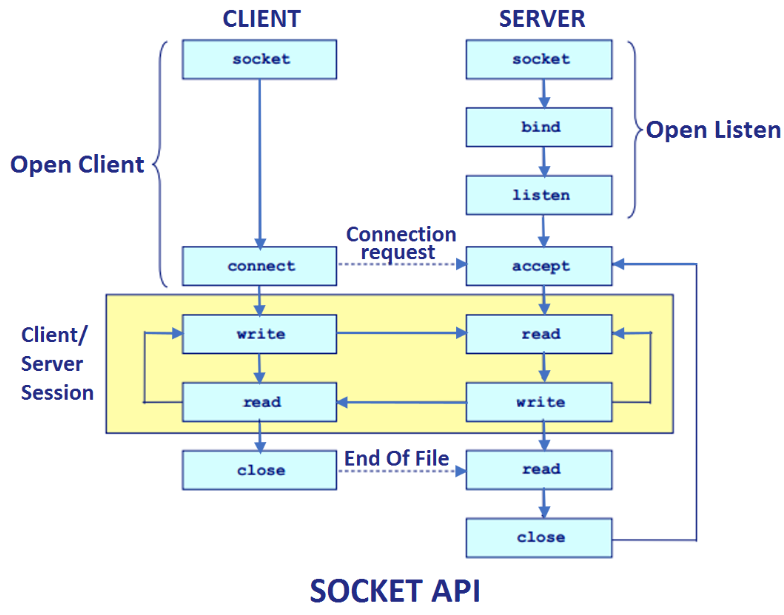

```java
public class SocketAPIDemoServer {

    public static void main(final String[] args) throws IOException {
        final var serverSocket = new ServerSocket(8080);
        while (!serverSocket.isClosed()) {
            final Socket socket = serverSocket.accept(); // blocks and socket can never be null
            handle(socket);
        }
    }

    private static void handle(final Socket socket) throws IOException {
        System.out.printf("Connected to %s%n", socket);
        try (
                socket;
                final InputStream in = socket.getInputStream();
                final OutputStream out = socket.getOutputStream()
        ) {
            // default buffer size is 8192
            // in.transferTo(out);

            int data;
            while ((data = in.read()) != -1) { // read one byte at a time and -1 means EOF
                out.write(transformAndEcho(data));
            }
        } finally {
            System.out.printf("Disconnected from %s%n", socket);
        }
    }

    private static int transformAndEcho(final int data) {
        return Character.isLetter(data) ? data ^ ' ' : data;
    }
}
```

**Designing a simple TCP-based Order Management System (OMS) server**

Suppose, we have an Order Management System (OMS) which is working as a TCP server and receiving stock trading orders
from various clients.

Once the order is received, following processing is done on the `Order` object before it is sent down to algorithmic
trading engine or directly to exchange (DMA):

- Validate the order client's wallet if enough funds
- Enrich the order with latest market data (best bid / best ask)
- Update the latest order state to persistence (log or database)

**_Single Threaded Blocking OMS_**

```java
public class SingleThreadedBlockingOMS {

    private static final AtomicInteger clientCounter = new AtomicInteger();

    public static void main(final String[] args) throws IOException {
        final var port = 8080;
        final var serverSocket = new ServerSocket(port);
        System.out.printf("Listening on port %d%n", port);
        while (!serverSocket.isClosed()) {
            final var socket = serverSocket.accept(); // blocks and socket can never be null
            handle(socket);
        }
    }

    private static void handle(final Socket socket) {
        System.out.println("\n----------------------------");
        System.out.printf("Connected to Client-%d on socket=[%s]%n", clientCounter.addAndGet(1), socket);
        try (
                socket
        ) {
            final var start = Instant.now();
            final var request = new Request(socket);          // parse the request
            final var order = new Order(request);             // create an Order from the request

            order.validate(ClientWallet.validate(request))    // validate the order client's wallet if enough funds
                 .enrich(MarketData.enrich(request))          // enrich the order with latest market data
                 .persist(OrderStatePersist.persist(request)) // update the latest order state to persistence
                 .sendToDownstream();                         // send the order to downstream

            final var timeElapsed = (Duration.between(start, Instant.now()).toMillis());
            System.out.printf("%nOrder [%s] sent to downstream in [%d] ms%n%n", order, timeElapsed);

        } catch (final IOException e) {
            throw new RuntimeException(e);
        } finally {
            System.out.printf("Disconnected from Client-%d on socket=[%s]%n", clientCounter.get(), socket);
            System.out.println("----------------------------\n");
        }
    }

}
```

This server is purely sequential and uses a single thread that does everything.

The thread is first blocked on `accept()`, listening for connections.

After a connection is established, that thread performs all the handling work before it can go back to listen
and wait for more connections.

In the example code above, each of the following takes around 1 second:

- parse the request
- create an Order from the request
- validate the order client's wallet if enough funds
- enrich the order with latest market data
- update the latest order state to persistence
- send the order to downstream

Therefore, it will take around `6 seconds` to complete **one** request and send the order to downstream (if no error).

This also means that if **three** requests arrive at the same time, it will take `6 + 6 + 6 = 18 seconds` to fulfill
them at `6 seconds` per request sequentially.

**_Thread per client OMS_**

We can do a quick optimization to handle multiple connections in parallel by creating a new **Thread** for each client
handling.

```
        while (!serverSocket.isClosed()) {
            final Socket socket = serverSocket.accept(); // blocks and socket can never be null
            new Thread(() -> handle(socket)).start();    // create a new thread to handle request
        }
```

The connection listening thread that calls `accept()` creates and starts a new **Thread** to handle the connection and
quickly goes back to accepting more connections.

The `handle()` method is left unchanged, but it's now executed in parallel by multiple threads, each handling their
connection.

The computation time of the previous example goes from `6 + 6 + 6 = 18 seconds` to `max(6, 6, 6) = 6 seconds`.

Now all requests from separate users are completely independent.

However, there are few caveats:

- Within a single request in the `handle()` method => parsing, validating, persisting and sending the order to
  downstream is all done in the same thread.
- Threads are scarce, and there is a limitation imposed on the maximum number of threads which can be created in an
  OS. Thus, the design doesn't scale well when the number of client connections will increase.

**_Thread per client and Thread per order-parsing OMS_**

The first issue above can be easily fixed by using multiple threads for order parsing, validating, persisting and
sending the order to
downstream.

```
            final var request = new Request(socket);          // parse the request
            final var order = new Order(request);             // create an Order from the request

            final var threads = getOrderParsingThreads(order, request);
            for (final var t : threads) {
                t.start();
            }
            for (final var t : threads) {
                t.join();
            }

            // send the order to downstream
            order.sendToDownstream();
```

```
    private static List<Thread> getOrderParsingThreads(final Order order, final Request request) {
        // validate the order client's wallet if enough funds
        final var t1 = new Thread(() -> order.validate(ClientWallet.validate(request)));

        // enrich the order with latest market data
        final var t2 = new Thread(() -> order.enrich(MarketData.enrich(request)));

        // update the latest order state to persistence
        final var t3 = new Thread(() -> order.persist(OrderStatePersist.persist(request)));

        return List.of(t1, t2, t3);
    }
```

After a request is parsed and an order is created, three helper threads are created: one for validating, one to enrich,
and one to persist the order.

The three threads are then started and begin to execute their code in parallel.

The `join` method is a blocking method that waits for a thread to terminate.

After all three of the helper threads are terminated, the connection-handling thread sends the fully assembled order
to downstream, and the time to process a request becomes `1 + 1 + max(1, 1, 1) + 1 = 4 seconds`.

This is a pattern sometimes known as `fork/join` or `scatter/gather`.

However, this design has again few caveats:

- the order needs to be created before the threads are started, and this order object needs to be **thread-safe**,
  because the `validate`, `enrich`, and `persist` methods are potentially called concurrently (and presumably could each
  modify the order). Therefore, these methods will need to use proper synchronization (such as locks) to make sure the
  threads don't interfere with each other in unwanted ways.

```
    public synchronized Order validate(final Order validatedOrder) {
        // validation logic...
        return validatedOrder;
    }

    public synchronized Order enrich(final Order enrichedOrder) {
        // enrichment logic...
        return enrichedOrder;
    }

    public synchronized Order persist(final Order persistedOrder) {
        // persistence logic...
        return persistedOrder;
    }

    public synchronized void sendToDownstream() {
        // connection logic to downstream...
        waitForOneSecond();
    }
```

- inefficient and uncontrolled thread creation - for `n` simultaneous connections, there could be `4n` threads created
  and destroyed each time.

We can do a small optimization here that instead of creating `4n` threads, we can use the connection handling thread
to make it `3n` threads per request.

```
            final var request = new Request(socket);          // parse the request
            final var order = new Order(request);             // create an Order from the request

            final var threads = getOrderParsingThreads(order, request);
            for (final var t : threads) {
                t.start();
            }

            // update the latest order state to persistence
            order.persist(OrderStatePersist.persist(request));

            for (final var t : threads) {
                t.join();
            }

            // send the order to downstream
            order.sendToDownstream();
```

```
    private static List<Thread> getOrderParsingThreads(final Order order, final Request request) {
        // validate the order client's wallet if enough funds
        final var t1 = new Thread(() -> order.validate(ClientWallet.validate(request)));

        // enrich the order with latest market data
        final var t2 = new Thread(() -> order.enrich(MarketData.enrich(request)));

        return List.of(t1, t2);
    }
```

This design is slightly better - `3n` threads instead of `4n` but it's still unnecessarily wasteful of threads.

And, the time to process a request is still same: `1 + 1 + max(1, 1, 1) + 1 = 4 seconds`.

A better approach is to **pool** generic worker threads together and rely on them as tasks occur.

**Thread pools** were introduced because threads are expensive; when threads become cheaper, the need for pooling
decreases.

**_Thread Pool Based OMS_**

The **Executor Pattern** aims to fix the above-mentioned issues:

- by creating pools of ready-to-use threads
- passing task to this pool of threads that will execute it


The threads in this pool will be kept alive as long as this pool is alive.

It means that the single thread will execute the submitted task => once the task finishes, the thread will return to the
pool and wait for a new task to be submitted for execution.

As compared to `Runnable` pattern, `Executor` pattern does NOT create a new thread.

However, the behavior is the same: both calls return immediately, and the task is executed in **another** thread.

We will create two thread pools in our OMS:

```
    private static final ExecutorService connectionHandlerPool = Executors.newFixedThreadPool(4);
    private static final ExecutorService orderHandlerPool = Executors.newFixedThreadPool(12);
```

Our client handler code will look like this:

```
        try {
            while (!serverSocket.isClosed()) {
                final var socket = serverSocket.accept(); // blocks and socket can never be null
                connectionHandlerPool.execute(() -> handle(socket));
            }
        } finally {
            connectionHandlerPool.close();
            orderHandlerPool.close();
        }
```

And, the order handler code will be changed to use the second pool:

```
            final var request = new Request(socket);          // parse the request
            final var order = new Order(request);             // create an Order from the request

            final var latch = new CountDownLatch(3);

            orderHandlerPool.execute(() -> {
                order.validate(ClientWallet.validate(request));
                latch.countDown();
            });

            orderHandlerPool.execute(() -> {
                order.enrich(MarketData.enrich(request));
                latch.countDown();
            });

            orderHandlerPool.execute(() -> {
                order.persist(OrderStatePersist.persist(request));
                latch.countDown();
            });

            latch.await();

            // send the order to downstream
            order.sendToDownstream();
```

This is a better design as now we have a limited number of threads as guaranteed in the thread pool size.

However, the time to process a request is still same: `1 + 1 + max(1, 1, 1) + 1 = 4 seconds`.

Few of the caveats here are:

- order is a shared object amongst all the threads and needs to be synchronized
- code is more complex and using helper objects like `CountDownLatch`

The OMS servers we have created so far are very imperative in style:

- Threads do things
- they act on a shared object, and
- they modify it

A better approach is to use **futures**.

**_Futures Based OMS_**

Futures are a standard Java abstraction that allows concurrent code to shift to a more **functional** flavor in which
threads run functions and produce values, while combining the synchronization capabilities of the **latch** mechanism
used earlier.

Essentially, a **future** represents an **asynchronously** running function and offers mechanisms for threads to wait
for the output of the function.

Running a blocking code in another thread is a way to avoid blocking the main thread of our application.

```
        ExecutorService service = ...;
        HTTPClient client = ...;
        Future<String> future =
                service.submit(() – >
                        client.get("https://github.com/backstreetbrogrammer/data"));
        // do some other stuff
        String response = future.get();
```

The call to `get()` is still a **blocking** call, but blocks another thread and not the `main` thread. Our application
thread is free to do something else.

We can get the response through this `future` object By calling `future.get()`, which is a blocking call.

Java 8's Concurrent API introduced `CompletableFuture`, a valuable tool for simplifying asynchronous and non-blocking
programming.

The `CompletableFuture` class implements `CompletionStage` interface and the `Future` interface.

Now, our order handling logic completely changes like this:

```
            final var request = new Request(socket);

            final var orderValidateFuture =
                    CompletableFuture.supplyAsync(() -> ClientWallet.validate(request), orderHandlerPool);
            final var orderEnrichFuture =
                    CompletableFuture.supplyAsync(() -> MarketData.enrich(request), orderHandlerPool);
            final var orderPersistFuture =
                    CompletableFuture.supplyAsync(() -> OrderStatePersist.persist(request), orderHandlerPool);

            new Order(request)
                    .validate(orderValidateFuture.join())
                    .enrich(orderEnrichFuture.join())
                    .persist(orderPersistFuture.join())
                    .sendToDownstream();
```

The implementation of the server is fairly straightforward:

Simply create a **future** for any part of the computation that needs to run **asynchronously**.

This approach pools threads for reuse, avoids the **latch** (futures implement their own **synchronization**), and,
importantly, the **order** is created and populated by a **single** thread and does not need to be **thread-safe**
anymore.

The new order object is created by the connection-handling thread **in parallel** with the validation, enrichment and
persistence tasks (which no longer need the order).

Thus, the time to process a request and send the order to downstream goes down from
`1 + 1 + max(1, 1, 1) + 1 = 4 seconds` to `1 + max(1, 1, 1) + 1 = 3 seconds`.

However, the fact that threads are **blocked** on the `join` method while waiting for futures to be completed remains
problematic in two ways:

- This **blocking** invites the possibility of **deadlocks**. The issue was addressed here by using **two** separate
  thread pools. On larger, more complex systems, however, the problem can become quite tricky. **Multiplying pools** or
  **increasing pool sizes** to guarantee the absence of deadlocks tends to result in a large number of threads which,
  when they are not blocked, lead to a suboptimal usage of computing resources.
- Blocking and unblocking threads, even in the best of scenarios, has a non-negligible cost. The actual **parking** and
  **unparking** of threads by the operating system take time. Furthermore, parked threads tend to see their data in
  processor-level caches overwritten by other threads, resulting in cache misses when the threads resume execution.
  Accordingly, techniques were devised to minimize thread blocking, ideally, to avoid it entirely.

**_Futures with Callbacks OMS_**

One of the oldest strategies is the idea of a **callback**.

Instead of waiting for the result of a future, which requires **blocking**, the developer specifies, as a **callback**,
the computation that will use this result.

The server can be rewritten using callbacks:

```
            final var request = new Request(socket);

            final var orderValidateFuture =
                    CompletableFuture.supplyAsync(() -> ClientWallet.validate(request), threadPool);
            final var orderEnrichFuture =
                    CompletableFuture.supplyAsync(() -> MarketData.enrich(request), threadPool);
            final var orderPersistFuture =
                    CompletableFuture.supplyAsync(() -> OrderStatePersist.persist(request), threadPool);

            final var order = new Order(request);
            
            orderValidateFuture.thenAccept(
                    validatedOrder ->
                            orderEnrichFuture.thenAccept(
                                    enrichedOrder ->
                                            orderPersistFuture.thenAccept(
                                                    persistedOrder ->
                                                            order.validate(validatedOrder)
                                                                 .enrich(enrichedOrder)
                                                                 .persist(persistedOrder)
                                                                 .sendToDownstream())));
```

Time taken is same as before: `1 + max(1, 1, 1) + 1 = 3 seconds`.

The future `thenAccept` method takes as its argument the code that will **consume** the output of the future.

Note that the invocation of `thenAccept` only registers this code for **later execution**; it does not wait for the
future to be completed and, thus, it takes very little time.

The actual object building will run later, in the thread pool, after the validation, enrichment and persistence tasks
are done. As a result, a single request is processed in one second as before.

Threads are never blocked in this server, and a single, reasonably sized pool can be used.

The code above is **free from deadlocks** for any pool size.

Indeed, setting `threadPool` as a **single-thread pool** would result in a sequential server, but would not cause any
deadlock.

However, still there is one caveat here:

- Callbacks are notoriously hard to write and even harder to debug.

In the simple callback illustration above, `thenAccept` calls are nested **three levels** deep.

**_Futures with composition OMS_**

Fortunately, modern futures offer other mechanisms to process their value in a non-blocking fashion.

In Java, a `thenCombine` method can be used to **combine** the results of two futures using a two-argument function, as
shown below:

```
            final var request = new Request(socket);

            final var orderValidateFuture =
                    CompletableFuture.supplyAsync(() -> ClientWallet.validate(request), threadPool);
            final var orderEnrichFuture =
                    CompletableFuture.supplyAsync(() -> MarketData.enrich(request), threadPool);
            final var orderPersistFuture =
                    CompletableFuture.supplyAsync(() -> OrderStatePersist.persist(request), threadPool);

            CompletableFuture.completedFuture(new Order(request))
                             .thenCombine(orderValidateFuture, Order::validate)
                             .thenCombine(orderEnrichFuture, Order::enrich)
                             .thenCombine(orderPersistFuture, Order::persist)
                             .thenAccept(Order::sendToDownstream);
```

Time taken is same as before: `1 + max(1, 1, 1) + 1 = 3 seconds`.

The handling thread creates a new order, as before, but wraps it in a **future** so that `thenCombine` can be called
for **validation**, and then it calls again with the **enrichment** and **persistence** tasks.

Finally, a **callback** `thenAccept` is used to send the order to downstream.

None of this code is **blocking**.

Pool threads jump from validation, enrichment and persistence tasks to order building and order sending, performing
tasks as they become available, even across separate requests.

In this case, the only actual processing that the connection-handling thread performs is the building of a base order.

#### Virtual Threads - Deep Dive

Every instance of `java.lang.Thread` in the JDK is a **platform thread**.

A **platform thread** runs Java code on an underlying **OS thread** and captures the OS thread for the code's entire
lifetime.

The number of **platform threads** is limited to the number of **OS threads**.

A **virtual thread** is an instance of `java.lang.Thread` that runs Java code on an underlying **OS thread** but does
not capture the **OS thread** for the code's entire lifetime.

This means that **many virtual threads** can run their Java code on the **same OS thread**, effectively sharing it.

While a **platform thread** monopolizes a precious **OS thread**, a **virtual thread** does not.

The number of **virtual threads** can be much larger than the number of **OS threads**.

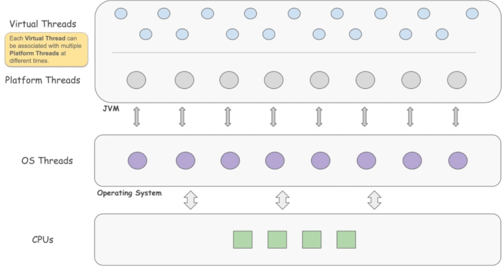

Virtual threads are a lightweight implementation of threads that are provided by the **JDK** rather than the **OS** and
may be treated as **user-mode threads**.

Virtual threads employ `M:N` scheduling, where a large number (`M`) of virtual threads is scheduled to run on a smaller
number (`N`) of OS threads.

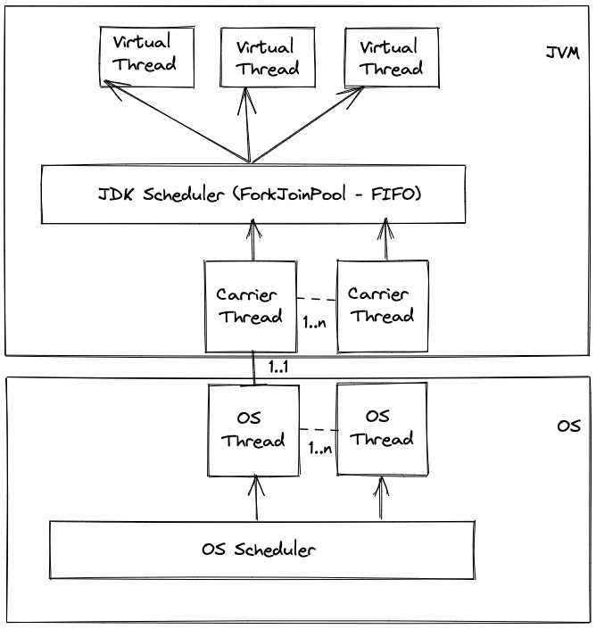

Virtual threads run by mounting an actual OS thread. When blocked, they unmount their OS thread, leaving it free to run
the code of other virtual threads.

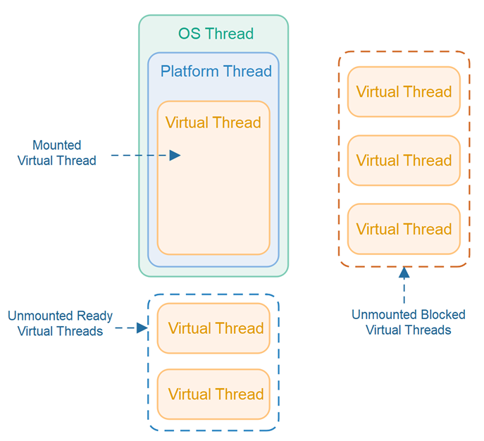

**_Code Demo_**

- Test Case 1: Test platform thread using Thread constructor

```
    @Test
    @DisplayName("Test platform thread using Thread constructor")
    void testPlatformThreadUsingThreadConstructor() throws InterruptedException {
        final var platformThread = new Thread(() -> System.out.printf("I am running inside thread=%s%n",
                                                                      Thread.currentThread()));
        platformThread.start();
        platformThread.join();
    }
```

Output:

```
I am running inside thread=Thread[#25,Thread-0,5,main]
```

- Test Case 2: Test platform thread using `Thread.ofPlatform()` method

```
    @Test
    @DisplayName("Test platform thread using Thread.ofPlatform() method")
    void testPlatformThreadUsingThreadOfPlatformMethod() throws InterruptedException {
        final var platformThread = Thread.ofPlatform().unstarted(() ->
                                                                         System.out.printf("I am running inside thread=%s%n",
                                                                                           Thread.currentThread()));
        platformThread.start();
        platformThread.join();
    }
```

Output:

```
I am running inside thread=Thread[#25,Thread-0,5,main]
```

- Test Case 3: Test virtual thread using `Thread.ofVirtual()` method

```
    @Test
    @DisplayName("Test virtual thread using Thread.ofVirtual() method")
    void testVirtualThreadUsingThreadOfVirtualMethod() throws InterruptedException {
        final var virtualThread = Thread.ofVirtual().unstarted(() ->
                                                                       System.out.printf("I am running inside thread=%s%n",
                                                                                         Thread.currentThread()));
        virtualThread.start();
        virtualThread.join();
    }
```

Output:

```
I am running inside thread=VirtualThread[#25]/runnable@ForkJoinPool-1-worker-1
```

- Test Case 4: Test multiple virtual threads

```
    @Test
    @DisplayName("Test multiple virtual threads")
    void testMultipleVirtualThreads() throws InterruptedException {
        final Runnable runnable = () -> System.out.printf("I am running inside thread=%s%n",
                                                          Thread.currentThread());
        final List<Thread> virtualThreads = new ArrayList<>();
        for (var i = 0; i < 3; i++) {
            virtualThreads.add(Thread.ofVirtual().unstarted(runnable));
        }
        for (final var virtualThread : virtualThreads) {
            virtualThread.start();
        }
        for (final var virtualThread : virtualThreads) {
            virtualThread.join();
        }
    }
```

Output:

```
I am running inside thread=VirtualThread[#27]/runnable@ForkJoinPool-1-worker-3
I am running inside thread=VirtualThread[#25]/runnable@ForkJoinPool-1-worker-2
I am running inside thread=VirtualThread[#26]/runnable@ForkJoinPool-1-worker-2
```

- Test Case 5: Test large number of virtual threads

The test case first obtains an `ExecutorService` that will create a new virtual thread for each submitted task.

It then submits `10,000` tasks and waits for all of them to complete:

```
    @Test
    @DisplayName("Test large number of virtual threads")
    void testLargeNumberOfVirtualThreads() {
        try (final var executor = Executors.newVirtualThreadPerTaskExecutor()) {
            IntStream.range(0, 10_000).forEach(i -> {
                executor.submit(() -> {
                    TimeUnit.SECONDS.sleep(1L);
                    return i;
                });
            });
        }  // executor.close() is called implicitly, and waits
    }
```

Output:

```
The test case runs in around 1 seconds => it means that all 10,000 integers were executed in parallel in virtual 
threads.
```

The task in this example is simple code — sleep for one second — and modern hardware can easily support 10,000 virtual
threads running such code concurrently.

Behind the scenes, the JDK runs the code on a small number of OS threads, perhaps as few as one.

Things would be very different if this program used an `ExecutorService` that creates a new **platform thread** for each
task, such as `Executors.newCachedThreadPool()`.

The `ExecutorService` would attempt to create 10,000 platform threads, and thus 10,000 OS threads, and the program might
crash, depending on the machine and operating system.

Things would be not much better if the program, instead, used an `ExecutorService` that obtains platform threads from a
pool, such as `Executors.newFixedThreadPool(200)`.

The `ExecutorService` would create 200 platform threads to be shared by all 10,000 tasks, so many of the tasks would run
sequentially rather than concurrently and the program would take a long time to complete.

For this program, a pool with 200 platform threads can only achieve a throughput of `200 tasks-per-second`, whereas
virtual threads achieve a throughput of about `10,000 tasks-per-second` (after sufficient warmup).

Moreover, if the 10_000 in the example program is changed to 1_000_000, then the program would submit 1_000_000 tasks,
create 1_000_000 virtual threads that run concurrently, and (after sufficient warmup) achieve a throughput of about
1_000_000 tasks-per-second.

If the tasks in this program performed a calculation for one second (e.g., sorting a huge array), rather than merely
sleeping, then increasing the number of threads beyond the number of processor cores would not help, whether they are
virtual threads or platform threads.

Virtual threads are not faster threads — they do not run code any faster than platform threads.

They exist to provide scale (higher **throughput**), not speed (lower latency).

There can be many more of them than platform threads, so they enable the higher concurrency needed for higher throughput
according to Little's Law.

To put it another way, virtual threads can significantly improve application **throughput** when:

- The number of concurrent tasks is high (more than a few thousand), and
- The workload is not CPU-bound, since having many more threads than processor cores cannot improve throughput in that
  case.

Virtual threads help to improve the **throughput** of typical server applications precisely because such applications
consist of a great number of concurrent tasks that spend much of their time **waiting**.

Besides that, we should also consider a few other points while using virtual threads:

- there is no improvement in **latency**, but only **throughput**
- virtual threads are always **daemon** threads => trying to set it to non-daemon will result in exception
- virtual threads should never be used as fixed-size thread pool
- virtual threads always have default priority => trying to change the priority will cause no effect

Let's get back to our OMS server design.

**_Virtual Threads based OMS_**

```java
public class VirtualThreadPerOrderHandlerOMS {

    private static final AtomicInteger clientCounter = new AtomicInteger();

    public static void main(final String[] args) throws IOException {
        final var port = 8080;
        final var serverSocket = new ServerSocket(port);
        System.out.printf("Listening on port %d%n", port);
        while (!serverSocket.isClosed()) {
            final var socket = serverSocket.accept(); // blocks and socket can never be null
            Thread.startVirtualThread(
                    () -> handle(socket, clientCounter.addAndGet(1))); // create a new virtual thread to handle request
        }
    }

    private static void handle(final Socket socket, final int clientNo) {
        System.out.println("\n----------------------------");
        System.out.printf("Connected to Client-%d on socket=[%s]%n", clientNo, socket);
        try (
                socket
        ) {
            final var start = Instant.now();
            final var request = new Request(socket);          // parse the request
            final var order = new Order(request);             // create an Order from the request

            final var virtualThreads = startOrderParsingVirtualThreads(order, request);

            for (final var t : virtualThreads) {
                t.join();
            }

            // send the order to downstream
            order.sendToDownstream();

            final var timeElapsed = (Duration.between(start, Instant.now()).toMillis());
            System.out.printf("%nOrder [%s] sent to downstream in [%d] ms%n%n", order, timeElapsed);

        } catch (final IOException | InterruptedException e) {
            throw new RuntimeException(e);
        } finally {
            System.out.printf("Disconnected from Client-%d on socket=[%s]%n", clientNo, socket);
            System.out.println("----------------------------\n");
        }
    }

    private static List<Thread> startOrderParsingVirtualThreads(final Order order, final Request request) {
        // validate the order client's wallet if enough funds
        final var t1 = Thread.startVirtualThread(() -> order.validate(ClientWallet.validate(request)));

        // enrich the order with latest market data
        final var t2 = Thread.startVirtualThread(() -> order.enrich(MarketData.enrich(request)));

        // update the latest order state to persistence
        final var t3 = Thread.startVirtualThread(() -> order.persist(OrderStatePersist.persist(request)));

        return List.of(t1, t2, t3);
    }

}
```

Time taken to process a request is: `1 + 1 + max(1, 1, 1) + 1 = 4 seconds`.

The main difference with using traditional threads is that virtual threads do NOT entail any **OS-level blocking**.

When a virtual thread invokes `join` on a thread that is still running, it does not block the underlying OS thread,
which continues to run other virtual threads.

In effect, the OS threads jump from code to code when using higher-order methods on **futures**, and they do so in a
familiar programming style.

Because they are lightweight, virtual threads are also cheap to create and don't need to be pooled.

This also has a big advantage that if there are many client requests being received at the same time - virtual
threads will be able to handle it proving much better **throughput**.

However, there is one drawback:

- Order must be **thread-safe** again and needs to be constructed first, before the validation, enrichment and
  persistence tasks are started.

This can be avoided by bringing back **futures** but having the futures run by **virtual threads**.

**_Virtual Threads with Futures OMS_**

```
            final var request = new Request(socket);

            final var orderValidateFuture = new CompletableFuture<Order>();
            final var orderEnrichFuture = new CompletableFuture<Order>();
            final var orderPersistFuture = new CompletableFuture<Order>();

            Thread.startVirtualThread(() -> orderValidateFuture.complete(ClientWallet.validate(request)));
            Thread.startVirtualThread(() -> orderEnrichFuture.complete(MarketData.enrich(request)));
            Thread.startVirtualThread(() -> orderPersistFuture.complete(OrderStatePersist.persist(request)));

            new Order(request)
                    .validate(orderValidateFuture.join())
                    .enrich(orderEnrichFuture.join())
                    .persist(orderPersistFuture.join())
                    .sendToDownstream();
```

Time taken to process a request is: `1 + max(1, 1, 1) + 1 = 3 seconds`.

The order is now created while the validation, enrichment and persistence tasks are running, and it doesn't need to be
thread-safe.

The key difference with using previous **futures based OMS** is that `join` is now implemented without blocking an OS
thread.

Performance-wise, both versions are equivalent: OS threads are reused by pooling and are never blocked, but they are
written in two very different styles, one more traditional (imperative) and the other more functional.

If we use `10_000` sockets client connection at the same time - virtual thread-based OMS will be able to handle it
without any issue.

```java
public class SocketClient {

    public static void main(final String[] args) throws IOException, InterruptedException {
        final var sockets = new Socket[10_000];

        // connect
        for (var i = 0; i < sockets.length; i++) {
            sockets[i] = new Socket("localhost", 8080);
            System.out.printf("Connected: [%s]%n", sockets[i]);
        }

        TimeUnit.SECONDS.sleep(1L);

        // disconnect
        for (final var socket : sockets) {
            if (socket != null) {
                socket.close();
                System.out.printf("Disconnected: [%s]%n", socket);
            }
        }
    }

}
```

However, platform threads based OMS using `Executors.newCachedThreadPool()` or **thread-per-client** may suffer from
connection exceptions and the servers using `Executors.newFixedThreadPool(n)` will suffer from throughput degradation
and take long time to serve all the clients and send the order to send downstream.

### Youtube

- [05 - Project Loom - Virtual Threads](https://youtu.be/YjG1cgwwES8)
- [06 - Limitation of current servers and Littles Law](https://youtu.be/_485_1ON0_A)
- [07 - TCP Socket Client-Server code demo](https://youtu.be/tpcejOwEYYY)
- [08 - Designing a simple TCP-based Order Management System server](https://youtu.be/onQfIXJgs60)
- [09 - Thread per client OMS](https://youtu.be/JpHG6indo9Q)
- [10 - Thread per client and Thread per order-parsing OMS](https://youtu.be/Da3DCRHLb74)
- [11 - Thread Pool Based OMS](https://youtu.be/q3Dw1dEi0mU)
- [12 - Futures Based OMS](https://youtu.be/37e4CeYFvsw)
- [13 - Futures with Callbacks OMS](https://youtu.be/cuh-J1yDq_s)
- [14 - Futures with composition OMS](https://youtu.be/bMRElW8Ra88)

